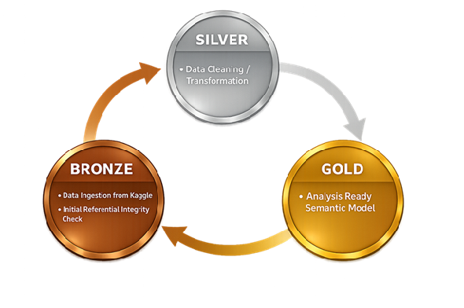

# 👩‍💻 Creator & Contact

# Chu Mei Ying, Michelle 

📍 Singapore
📧 mychuy2k@gmail.com

📞 +65 9002 9066

🔗 LinkedIn: https://www.linkedin.com/in/chu-michelle-88312371/

# 🌱 Bio

• Experienced in shipping and logistics operations 
• Transitioning into data engineering and analytics 
• Passionate about practical, data-driven problem solving

# 🚀 My Story
##
• Guided multiple shipping systems implementation and analytics initiatives 
• Recognized value of scalable data platforms 
• Now building structured, reliable data pipelines

# 🧰 Tools & Technologies
##
• Python, SQL, basic Java 
• Power BI, Tableau, Excel 
• PostgreSQL, Azure, Git, Linux

# 💡 Core Skills
##
• Data analysis and visualization 
• ETL pipeline design fundamentals 
• Business process understanding

# 🏗️ Featured Project: 

# _Data cum Tech Job Portal_
##
(https://MChu2019.github.io/MChu2019/project.html)

# _NHL Game Analytics Data Platform_

# 🌈 Diversity of Work
##

• Logistics operations analytics 
• Cost and revenue analysis 
• Cross-functional stakeholder collaboration

# 🎯 Unique Selling Proposition
##

• Business domain understanding 
• Applied data engineering skills 
• Practical, scalable solutions mindset

# 📌 What’s Next
##
    
• Seeking Data Analysis and Engineer opportunities 
• Eager to grow technical expertise 
• Committed to continuous learning

Thank you for exploring my portfolio.
